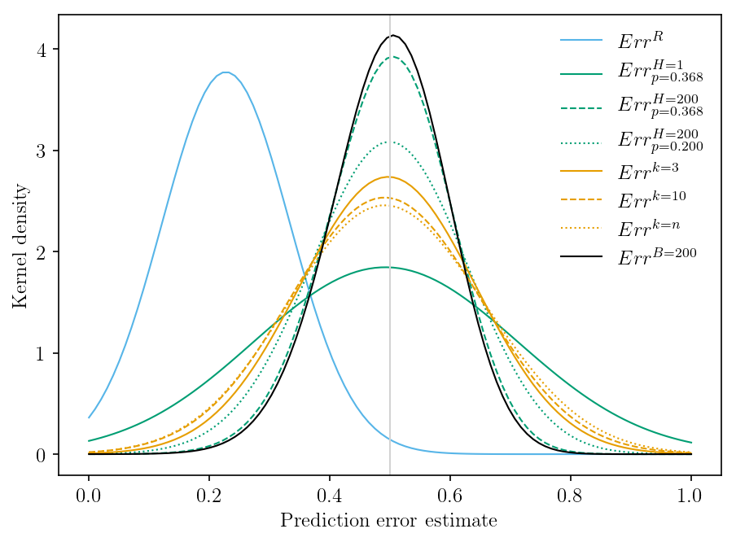

# Resampling methods for evaluating classification accuracy of wildlife habitat models

This is a replication of the following article:

Verbyla DL, Litvaitis JA (1989) Resampling methods for evaluating classification accuracy
of wildlife habitat models. Environmental Management 13:783-787 https://doi.org/10.1007/BF01868317

where the authors examined different resampling methods to test wildife habitat models.

## Pre-requisites

This replication has been written and tested on Windows 10 using the
following packages:

 * Python 3.6.4
 * Numpy 1.14.2
 * Scikit-learn 0.19.1
 * Matplotlib 2.1.2
 * pandas 0.22.0

An installation of LaTeX is required to reproduce the figure annontations exactly, but is not required by the replication.