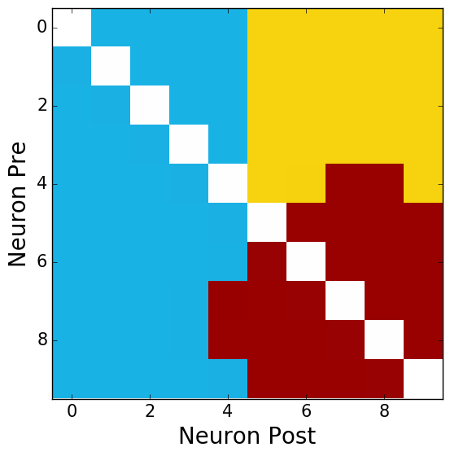
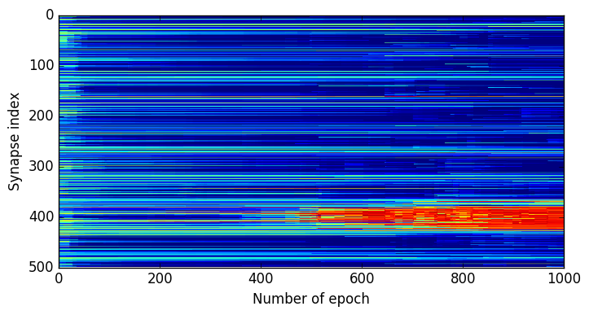

### ReScience submission repository

This is the submission repository for the [Re**Science** journal](https://rescience.github.io).

**Author:** René Larisch (rene.larisch@informatik.tu-chemnitz.de)

This is a replication of:

Connectivity reflects coding: a model of voltage-based STDP with homeostasis,
C. Clopath, L. Büsing, E. Vasilaki and W. Gerstner, In: Nature Neuroscience 13.3
(2010), pp. 344–352, doi= 10.1038/nn.2479

The reimplementation is written in Python (v2.7) with the help of hte neuro-simulator ANNarchy (v4.6.4),
Numpy (v1.11.0) and Matplotlib (v1.5.1).

#### Data

The experiment for the emergence of V1 simple-cell-like receptive fields needs the dataset of 10 natural scenes from Olshausen and Field (1996).
Dataset can be found on the webpage of Olshausen (http://www.rctn.org/bruno/sparsenet/). Please note, that the whitened natural scenes are required.

#### Model

The implementation of the model can be found in the **code** directory.
It exists a model version with a fixed and static homeostasic mechanisms (can be found in *code/net_fix.py*),
and a model version with a dynamic homeostasic mechanisms (can be found in *code/net_homeostatic.py*).

#### Results

