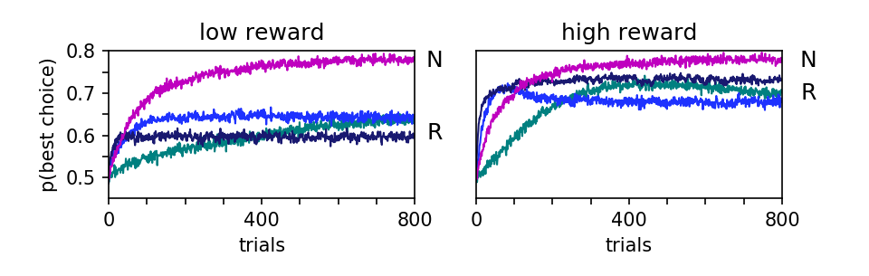
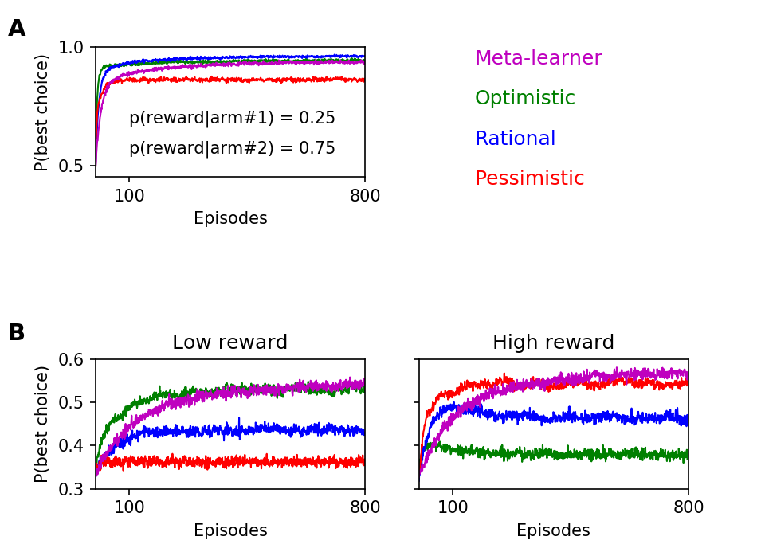

# Introduction

Reinforcement learning represents a fundamental cognitive process: learning by trial and error to maximize rewards and minimize punishments. Current and most influential theoretical models of reinforcement learning assume a unique learning rate parameter, independently of the outcome valence (@sutton1998introduction, @o2004dissociable, @behrens2007learning). However human participants were shown to integrate differently positive and negative outcomes (@frank2004carrot, @frank2007genetic, @sharot2011unrealistic). This motivated the reference article to implement a modified version of the reinforcement learning model, with two distinct learning rates for positive and negative outcomes (@caze2013adaptive).

They have shown that although differential learning rates shifted reward predictions and could thus be seen as a maladaptive bias, this model can outperform the classical reinforcement learning model on tasks with specific outcome probabilities. Following @caze2013adaptive's predictions, a subsequent empirical article have modeled human behavior on these specific tasks (@gershman2015learning). The question is still an active research area, as various articles have further investigated the difference learning rates bias (@garrett2014robust, @moutsiana2015human, @shah2016pessimistic, @garrett2017optimistic, @lefebvre2017behavioural, @palminteri2017confirmation).

A link to the pdf version of the reference article was posted on the last author's laboratory website (\url{http://www.vandermeerlab.org/publications.html}), but the corresponding code was not available (\url{https://github.com/vandermeerlab/papers/tree/master/Caze_vanderMeer_2013}). We believe that an openly available code repository replicating the results of @caze2013adaptive's paper can be helpful to the scientific community. We therefore implemented the model and analysis scripts using Python, with numpy, random and matplotlib libraries.

# Methods

We first implemented our scripts on Matlab, as we were more familiar with this language, and then adapted them on Python.

We used the modeling description of the reference article to implement our replication. They used standard Q-learners with a softmax action selection rule (@sutton1998introduction), and their precise description enabled us to implement them with low difficulty. But we found four ambiguities in the simulation procedure.

First, the authors described their analytical results to be valid for "$Q_0 \neq \{-1, 1\}$" in section 2, but did not specify what value of $Q_0$ they used in all the following simulations. We chose to use $Q_0 = 0$, as this initial value is the middle point between the two possible outcomes (i.e., -1 and 1). As we replicated all the original figures, even the dynamics in the beginning of the learning curves (see Figures @fig:figure2 A, @fig:figure3 and @fig:figure4 B), we believe the reference article must have used similar initial Q-values.

Second, regarding the parameter setting for Figure @fig:figure1's simulations, the ratio of $\alpha^+$ over $\alpha^-$ was said to be either 0.25, 1 or 4, but they did not specify what were the exact values of $\alpha^+$ and $\alpha^-$ used. We thus set them according to the following description of the pessimistic, rational and optimistic agents in section 3, i.e.,:

* $\alpha^+ = 0.1$ and $\alpha^- = 0.4$ for the ratio of 0.25
* $\alpha^+ = 0.1$ and $\alpha^- = 0.1$ for the ratio of 1
* $\alpha^+ = 0.4$ and $\alpha^- = 0.1$ for the ratio of 4

Third, the number of iterations made to generate Figures @fig:figure3 and @fig:figure4 were not indicated, and we assumed the authors used the same number as in Figures @fig:figure1 and @fig:figure2 (i.e., 5,000 runs).

Finally, in the reinforcement learning framework, the probabilities to choose each action are computed, then used to select an action through a pseudo-random generator. In the reference article, it was sometimes unclear whether the analyses were performed on the probabilities of choice, or rather the proportions of implemented choices. For example Figure 2's legend indicated: "Mean probability of choosing the best arm", suggesting that the probabilities themselves were used. However, when commenting the figure in section 3, the authors appeared to say that the actual choices were rather used: "the optimistic agent learns to take the best action significantly more than the rational agent". For our analyses, we started by using the probabilities of choice, as this would lead to more clear, less noise-corrupted results. However we then obtained very smooth learning curves, and were unable to reproduce the spikiness of the original Figures 2, 3 and 4. We thus computed the proportions of implemented choices for all our figures.

# Results

We numbered our figures in the same way as the reference article. 

All our figures reproduced the patterns of the original results. We were even able to replicate the fine-grained details of the learning curves, like the early bumps in performance in the high-reward task (Figures @fig:figure2 A, @fig:figure3 and @fig:figure4 B, right panels, around 50-100 trials). In Figure @fig:figure1, the mean and the variance of the Q-values were also very similar as the ones in the original figure.

The only discrepancy we found was in Figure @fig:figure4 A. Although the general pattern was replicated, our learning curves appeared smoother than in the reference article. As the number of simulations were not explicitly specified for this figure, we cannot know if this is due to us running a higher number of simulations than the reference article, or from another difference in model implementation.

{#fig:figure1}

{#fig:figure2}

{#fig:figure3}

{#fig:figure4}

# Conclusion

All the figures in @caze2013adaptive have been successfully reproduced with high fidelity, and we confirm the validity of their simulations. Overall the whole replication procedure was smooth: the models were implemented with low difficulty, and the simulations were quite straightforward apart from a few obscure details. We hope this replication can foster future research in the domain.

# References
