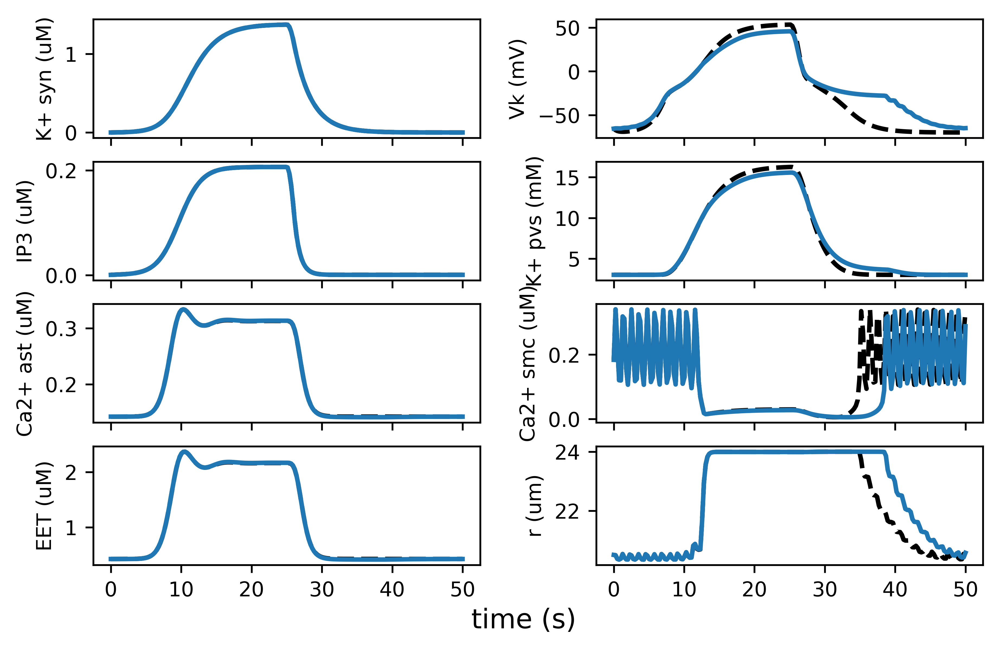

# Introduction

Witthoft and Karniadakis [1] introduced a bidirectional model for communication via chemical signalling within the neurovascular unit (NVU), which comprises a neuron, astrocyte and small artery. Functional hyperemia is an important mechanism in the brain, by which an increased neuronal metabolism leads to an increase of blood flow in surrounding arteries in order to maintain adequate oxygen and nutrient supply to the active neurons. This process works via a cascade of chemical signalling processes from neurons to astrocytes to arteries. The unidirectional vascular response to increased neuronal demands has previously been modelled [2,3], however, there is evidence that vascular activity also has an effect on neurons [4]. This bidirectional response is implemented in [1]. The paper contains the differential equations that are being modelled, however no code repository is provided. The model is useful for the investigation of the effect of cerebrovascular diseases on the brain and thus an openly available code repository reproducing the results of this paper will be helpful to other researchers.

# Methods

The paper indicates that the original code was written in Matlab, while the reproduction presented here is written in Python 3.5. The model is given as a series of ordinary differential equations (ODE), which are implemented as a function nvu(). This function is solved using the scipy.integrate library. Initial attempts to solve the system of ODE using the standard function odeint() failed. Instead, the equations can be solved using the function ode() with the integration method set to "lsoda", which automatically selects between the Adams method for non-stiff and BDF for stiff problems. The ODE system described in [1] is a stiff system.

The code was implemented following the descriptions of the equations in [1], but upon cross-checking equations against their equivalents in [2,3,4] it became evident that some of the equations contain typographical errors. This was confirmed after contacting the authors of [1]. Changes to the equations are as follows:

* $I_{\Sigma K}$ in (20) should be defined as $I_{\Sigma K} = -J_{\Sigma K} C_{astr} \gamma$
* (31) $I_K = g_K n (V_m - v_K)$
* (A.1) Term $\frac{1}{2 \alpha} I_{Ca}$ should be $\alpha I_{Ca}$
* (A.6) The brackets around the exponential function are set incorrectly, it should read $\exp \left( \frac{-(y' - y'_0)^2}{2 \left[ y'_1/(y' + y'_2) \right]^{2 y'_4}} \right) - y'_3$
* Decimal of parameter $a$ in Table B2 is in the wrong place, it should read $a = 502.65$ $\mu m^2$

# Results

{#fig:fig1}

Results should be compared with original results and you have to explain why
you think they are the same or why they may differ (qualitative result vs
quantitative result). Note that it is not necessary to redo all the original
analysis of the results.

# Conclusion

Conclusion, at the very minimum, should indicate very clearly if you were able
to replicate original results. If it was not possible but you found the reason
why (error in the original results), you should exlain it.

Heading 1                          Heading 2
---------- ----------- ----------- ----------- ----------- -----------
cell1 row1 cell2 row 1 cell3 row 1 cell4 row 1 cell5 row 1 cell6 row 1
cell1 row2 cell2 row 2 cell3 row 2 cell4 row 2 cell5 row 2 cell6 row 2
cell1 row3 cell2 row 3 cell3 row 3 cell4 row 3 cell5 row 3 cell6 row 3
---------- ----------- ----------- ----------- ----------- -----------

Table: Table caption {#tbl:table}

A reference to table @tbl:table.
A reference to figure @fig:logo.
A reference to equation @eq:1.
A reference to citation @markdown.

{#fig:logo}

$$ A = \sqrt{\frac{B}{C}} $$ {#eq:1}

# References

[1] Witthoft A, Karniadakis GE (2012) A bidirectional model for communication in the neurovascular unit. *Journal of Theoretical Biology* 311: 80-93.

[2] Bennett MR, Farnell L, Gibson W (2008) Origins of blood volume change due to glutamatergic synaptic activity at astrocytes abutting on arteriolar smooth muscle cells. *Journal of Theoretical Biology* 250: 172-185.

[3] Farr H, David T (2011) Models of neurovascular coupling via potassium and EET signalling. *Journal of Theoretical Biology* 286: 13-23.

[4] Gonzalez-Fernandez JM, Ermentrout B (1994) On the origin and dynamics of the vasomotion of small arteries. *Mathematical Biosciences* 119: 127-167.

[5] Moore CI, Cao R (2008) The hemo-neural hypothesis: on the role of blood flow in information processing. *Journal of Neurophysiology* 99: 2035-2047.