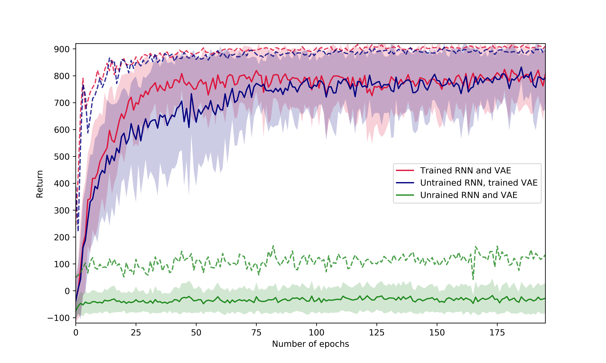

# Introduction

Recently, Deep Reinforcement Learning (DRL) has achieved impressive results in
a variety of domains, such as video game playing (@mnih) zero-sum games (@silver),
and continuous control (@ddpg).  Still, DRL approaches are often brittle,
sensitive to small changes in hyperparameters, implementation details and minor
environment perturbations. Besides, training performance can widely vary from
run to run. Those factors often make reproduction of experimental results
challenging (@henderson, @rlblogpost).

In addition to its sensitivity, DRL is also known to be sample inefficient, in
the sense that it requires huge amounts of environment interactions to obtain
good results, even for simple tasks. Model-based reinforcement learning has
gained interest to improve sample efficiency. With an accurate and
computationally cheap model of the world, the burden of collecting new samples
could be considerably alleviated, since the model could, in principle, generate
huge amounts of reliable samples, and be used for planning without interacting
with the environment. Besides, features provided by a predictive model of the
world could constitue relevant inputs to a controller, and ease the
optimization process.

@NIPS2018_7512 provided a simple, yet successful model-based reinforcement learning
approach. It revolves around a three part model, comprised of:

  1. A Variational Auto-Encoder (@kingma), a generative model, which learns both an encoder and a decoder. The encoder's task is to compress the input images into a compact latent representation. The decoder's task is to recover the original image from the latent representation.
  2. A Mixture-Density Recurrent Network (@graves), trained to predict the latent encoding of the next frame given past latent encodings and actions. The mixture-density network outputs a Gaussian mixture for predicting
the distribution density of the next latent variable.
  3. A simple linear Controller. It takes as inputs both the latent encoding of the current frame and the hidden state of the MDN-RNN given past latents and actions and outputs an action. It is trained to maximize the cumulated reward using the Covariance-Matrix Adaptation Evolution-Strategy (@hansen), a generic gradient-free black box optimization algorithm.

On a given environment, the model is trained sequentially as follows:

  1. Sample randomly generated rollouts from a well suited *random policy*.
  2. Train the VAE on images drawn from the rollouts.
  3. Train the MDN-RNN on the rollouts encoded using the encoder of the VAE. To reduce computational load, we trained the MDN-RNN on fixed size subsequences of the rollouts.
  4. Train the controller while interacting with the environment using CMA-ES. At each time step, the controller takes as input both the encoded current frame and the recurrent state of the MDN-RNN, which contains information about all previous frames and actions.

Alternatively, if the MDN-RNN is good enough at modelling the environment, the controller can be trained directly on simulated rollouts in the dreamt environment.

# Methods

## Reproducibility of the original results

We reproduced the authors results on the CarRacing environment (@gym). We only used
the paper description, and took the same hyperparameters as the original paper,
unless stated otherwise below, or originally unspecified. We did not use any
original sources, and we did not contact the authors. The exact training
procedure is detailled below.

### Data generation
The original paper started by generating rollouts using a random policy
interacting with the environment. The policy was not specified. In our
experiments we tested two types of policies. The first policy generates
independant standard normal actions at each step. The second policy 
generates actions according to a discretized brownian motion, with a discretization
parameter of $\frac{1}{50}$. This means that each component of the action (the action
is three dimensional) is generated as
$$a^k_{t+1} = a^k_{t} + \frac{1}{\sqrt{50}} \varepsilon^k_t$$
where the $\varepsilon$'s are i.i.d. standard normal random variables. The data
samples generated by the first policy lack diversity, and the car only moves
in a very restricted area of the track. The samples generated by the second
policy, on the other are much more diverse, and were consequently used for
the next stages of training.  The original paper generated 10,000 rollouts. For
our replication, we generated 1,000 rollouts, to reduce the computational load.

### Variational auto-encoder (VAE) training
The VAE is trained following the training procedure of the original paper, on
the rollouts previously generated. The model is the same as the one detailled
in the paper. The first $600$ rollouts are used as a training set, and the next
$400$ as a validation set. The VAE is optimized using Adam (@adam) with default
hyperparameters, learning rate $10^{-3}$, $\beta_1=0.9$, $\beta_2=0.999$. Since
the dataset is quite large, validation is perfomed each time a fifth of the
dataset has been processed. Each step of validation is performed on $200$
samples of the validation dataset. The learning rate is halved each time the
validation performance has not improved for $5$ consecutive evaluations.
Training is stopped when the validation performance has not improved for $30$
consecutive evaluations. Training was performed on a single Quadro GP100 GPU,
with 16Go of RAM.

### Mixture Density Recurrent Neural Network (MDN-RNN) training
Similarily the MDN-RNN is trained following the original paper procedure.
The model is the same as the one detailled in the paper.  The training splits
are the same as for the VAE, and evaluations are also performed using the same
schedule. The network is trained and validated on subrollouts of length $32$.
RMSprop (@rmsprop) is used to optimize the MDN-RNN, with a learning rate $10^{-3}$,
and $\alpha=0.9$. The learning rate schedule and early stopping policy of the
VAE training are used without any modification.  Training was performed on a
single Quadro GP100 GPU, with 16Go of RAM.

### Controller training with CMAES
Finally, the controller is trained using the Covariance Matrix Adaptation
Evolution Strategy (@hansen), using the python library pycma (@pycma). As in
the original paper, the controller is a linear network that takes as inputs the
concatenation of the output of the VAE and the hidden layer of the MDN-RNN. For
a set of parameters of the controller, the loss function is obtained by
averaging the returns from $16$ rollouts of length at most $1000$. The
population size used for CMAES is $64$, and an initial standard deviation of
$0.1$ is used. Rollouts are executed parallely, on $64$ threads, with models
sharing $8$ V100 GPUs.

<!--  -->

# Results

## Reproducibility
 
On the CarRacing-v0 environment, results were reproducible with relative ease.
<!-- We were pleasantly surprised to observe that -->
The model achieved good results on
the first try, relatively to the usual reproducibility standards of deep
reinforcement learning algorithms (@rlblogpost, @henderson). Our own
implementation reached a best score of 895, below the 906 reported in the
paper, but much better than the second best benchmark reported which is around
780. Results are further detailled in the tables and fig. @fig:curves.
Fig. @fig:curves displays the learning curves of CMAES in the three considered
setups. Solid lines represent the mean performance and standard deviation of
the population, while dashed line represent the maximal performance. At test time,
we select the best performing element of the CMAES population.

## Additional experiments

We wanted to test the impact of the MDN-RNN on the results. Indeed, we observed
during training that the model was rapidly learning the easy part of the
dynamic, but mostly failed to account for long term effects and multimodality. 

In the original paper, the authors performed an ablation study, and compared
their results with a model without the MDN-RNN. They obtained the following
scores:

  Method                             Average score  
 ---------------------------------- --------------- 
  Full World Models @NIPS2018_7512   906 ± 21      
  without MDN-RNN @NIPS2018_7512       632 ± 251  

Still, we wanted to investigate this question even more. We also trained the
controller, but with an untrained MDN-RNN instead of the trained one (we kept it
at its random initialization values). Similarily, we tried training a controller
with both an untrained MDN-RNN and an untrained VAE. 
Surprisingly, controllers trained with untrained recurrent
models achieve results close to the values of the original controller, while 
controllers with both untrained VAE and MDN-RNN achieves very low performance.

  Method                           Average score  
 --------------------------------- --------------- 
  With a trained MDN-RNN             895 ± 79
  With an untrained MDN-RNN          866 ± 69
  With untrained MDN-RNN and VAE     131 ± 66

It seems that the training of the MDN-RNN does not significantly improve the
performance. Our interpretation of this phenomenon is that even if the
recurrent model is not able to predict the next state of the environment, its
recurrent state still contains some crucial information on the environment
dynamic. Without a recurrent model, first-order information such as the
velocity of the car is absent from individual frames, and consequently from
latent codes. Therefore, strategies learnt without the MDN-RNN cannot use such
information.  Even a random MDN-RNN still holds some useful temporal
information, which is enough to learn a good strategy on this problem.
This may relate to observations made in the field of *echo state networks* (ESN, @jaeger-tuto).
ESNs consist in untrained but properly initialized reservoir recurrent networks, which, along with
properly trained output weights, prove sufficient to solve problems with non trivial
temporal dependencies. In our case, the untrained MDN-RNN seems to also behave like a
reservoir for temporal information, necessary to solve the task at hand.

# Conclusion

We reproduced the paper "World Models" on the CarRacing environment, and made
some additional experiments. Overall, our conclusions are twofold:

* The results were easy to reproduce. It probably means that the method on this
  problem does not only achieve high perforance but is also very stable. This
  is an important remark for a deep reinforcement learning method.

* On the CarRacing-v0 environment, it seems that the recurrent network only
  serves as a recurrent reservoir, enabling access to crucial higher order
  information, such as velocity or acceleration. This observation needs some
  perspective, it comes with several interrogations and remarks:
    * (Ha et al. 2018) reports good results when training in the simulated
      environment on the VizDoom task. Without a trained recurrent forward
      model, we cannot expect to obtain such performance.
    * On CarRacing-v0, the untrained MDN-RNN already obtains near optimal
      results. Is the task sufficiently easy to alleviate the need for a good
      recurrent forward model?
    * Learning a good model of a high dimensional environment is hard. It is
      notably difficult to obtain coherent multi modal behaviors on long time
      ranges (i.e. predicting two futures, one where the next turn is a right
      turn, the other where it is a left turn). Visually, despite the latent
      gaussian mixture model, our model doesn't seem to overcome this
      difficulty. Is proper handling of multi modal behaviors key to leveraging
      the usefulness of a model of the world?

{#fig:curves}

# References

