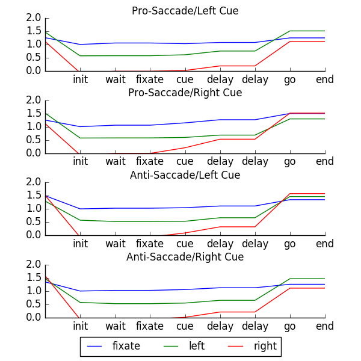
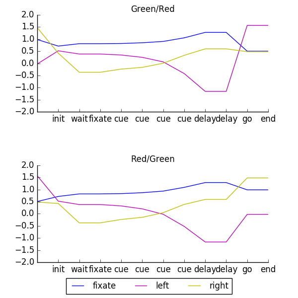

# Introduction

The reference paper [@rombouts:2015] introduces a new reinforcement learning model, called AuGMEnT, which uses memory
units to learn sequential tasks. The results presented suggest new approaches in understanding the acquisition of
tasks requiring working memory and attention, as well as biologically plausible learning mechanisms. The model improves on
previous reinforcement learning schemes by allowing tasks to be expressed more naturally as a sequence of inputs and outputs.
An implementation of the model was provided by the author, it helped verify the correctness of the replicated computations.
The script written for this replication uses Python 3 along with NumPy and the multiprocessing libraries for speedup
and matplotlib for the generation of graphics.

# Methods

## Model

The initial intention was to implement the model using an artificial neural network
simulator. The simulation tool ANNarchy [@vitay:2015] was considered for its ability to simulate rate-coded
networks. Unfortunately, there were several incompatibilities with AuGMEnT. The fixed order of evaluation between entities,
i.e. connections then populations, and the unspecified order of evaluation between different populations make it difficult to implement
cascading evaluations. The use of ANNarchy was abandoned and it was instead decided to write a custom script to simulate the network.

The paper's description of the model details all the update functions and is relatively straight forward to
implement, only the initial value of $Q_{a}(t-1)$ was not provided for the first computation of $\delta$ in equation 17.
Where the author's implementation uses $Q_{a}(t)$, it was decided to use a more naive solution and set it to 0.
It might also be useful to clarify the nature of the feedback weights $w'$ in equations 14 and 16: once an action is selected,
only the feedback synapses leaving the corresponding selected Q-value unit are activated to update tags,
more precisely: $w'_{ij} = w_{ij} \times z_{i}$. The model could also have specific feedback synapses but the simpler method is to
use the feedforward synapses' weights.

To offer some discussion about the model and its limits, the first point to bring forward would be its artificial time management.
The extreme discretization of time and explicit signals such as trial begin and end make it difficult to consider real-time simulation
or even realistic environments implementations. These constraints became apparent when trying to use ANNarchy.
In fact, the authors have published a more continuous version of AuGMEnT to address theses issues [@zambrano:2015].
Another possible weakness worth noting is the ambiguity of some memory traces. Because the traces in memory units are the sums of
changes in input, there exist sequences the model would be incapable of distinguishing.
For example, the sequences `((0, 0), (1, 0), (1, 1))` and `((0, 0), (0, 1), (1, 1))` have the same memory traces `(1, 1)`.

## Tasks

The descriptions of the tasks used to test the network are somewhat minimal and it was necessary
to refer to other resources for more informations. In this section, some details of implementation are exposed.

For the fixation tasks , i.e. saccade/anti-saccade and probabilistic decision making, the sequence of phases is as listed:

1. *Begin*: blank screen for one step.
2. *Fixation*: fixation point on screen for a maximum of 8 steps.
Once the network has fixated the point, it has to maintain fixation for an additional step before moving on to the next phase with a potential reward.
^[In the code, this phase is split in a *Wait* phase to wait for the network to fixate once and *Fixate* phase to make sure it keeps fixating.]
3. *Cues*: all visual cues are displayed (over several steps when there are multiple shapes).
4. *Delay*: only the fixation points is on screen for two steps.
5. *Go*: the screen appears blank for a maximum of 10 steps. The network has to choose a direction to look at, if it chooses the intended target, it is rewarded.
6. *End*: extra step to give the end reward and signal the end of the trial with a blank display.

Additional informations were found in the author's implementation of the saccade/anti-saccade task:
once the network has fixated the point in the *Fixation* phase, it has to maintain fixating until the *Go* signal where the screen turns off,
otherwise the experiment is failed. Moreover, during the *Go* phase, the gaze can only be chosen once, if it is not the target, the trial fails.

The provided code did not implement the probabilistic decision making task but, fortunately, the original experiment's article [@yang:2007]
provided a more thorough methodology description.
The shaping strategy for the probabilistic decision making task consists in increasing gradually the difficulty
of the task. The table 3 in the article describes all 8 levels of difficulty. The column *# Input Symbols* is
the size of the subset of shapes. The network is not presented all shapes immediately:
first, the two shapes with infinite weights are used, then shapes with the smallest absolute weights are added as the difficulty increases.
The column *Sequence Length* is the number of shapes shown during a trial. The more shapes there are on screen, the more difficult
it is to determine which target should be chosen.
A number of settings are randomized, such as which shapes should appear, their order of apparition, but also their locations around
the fixation point. The first shape can appear in any of the 4 locations, the second in any of the remaining 3 locations, etc.
If the total weight of the input symbols is infinite the corresponding target is guaranteed to give the reward.
If the total weight is 0, meaning both targets are equally likely to be rewarded, the network can look in either
direction for the trial to be successful, but only one target gives a reward.
Finally, the triangle and heptagon, shapes with infinite weights, cancel each other in the computation of the total weight.

# Results

Only the saccade/anti-saccade task and the probabilistic decision making task were implemented.
For the probabilistic decision making task, the results are very similar. However, the saccade/anti-saccade task results
are slightly worse than announced in the original article. The results are presented in table @tbl:results.
Since the convergence time and success rate are fairly sensible to the task's protocol, it is possible the differences come
from undocumented changes in the experiment.
Qualitative results such as the use of shaping strategy to obtain better performances are however confirmed by this replication.
See also figures @fig:saccade and @fig:probabilistic for the replicated activity traces of figures 2D and 4C in the reference article.

Task                     Success in [@rombouts:2015]   Success   Convergence in [@rombouts:2015]   Convergence
----------------------- ----------------------------- --------- --------------------------------- -------------
Saccade with shaping               99.45%               89.00%             4100 trials             3966 trials
Saccade without shaping            76.41%               64.00%                 -                  4284.5 trials
Probabilistic decision             99.0%                100.0%             55234 trials            55162 trials
----------------------- ----------------------------- --------- --------------------------------- --------------

Table: Results {#tbl:results}

{#fig:saccade}

{#fig:probabilistic}

# Conclusion

The results obtained are comparable to those announced in the article. Ambiguities in the
experiments' descriptions could be the cause for worse performances, but do not contradict the
article's overall conclusion.

# References
