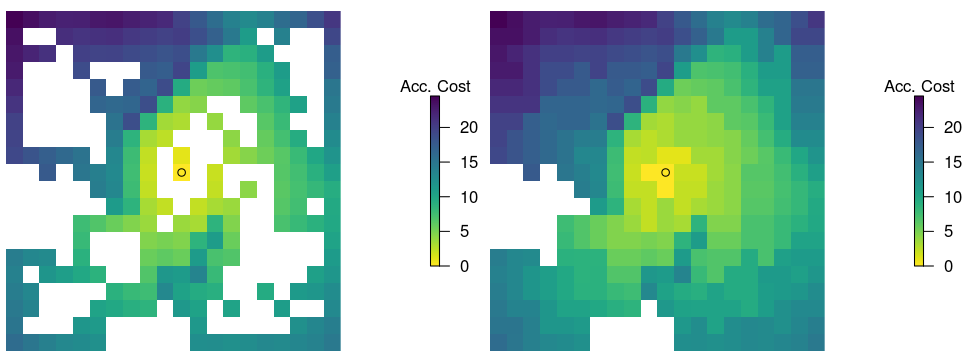

# Introduction

We propose a reference implementation of [@etherington2012least] that introduces a method for generating accumulated cost surfaces using irregular landscape graphs. According to the original article, irregular landscape graphs allow for faster processing speeds and avoid directional bias relative to regular landscape graphs. The original implementation was made in Python whose sources are available upon request to the author of the original article. The reference implementation we propose has been coded in R because of the strength of existing libraries for generating accumulated cost surfaces using regular landscape graphs [@gdistance]. 

# Methods

We used the description of the model as well as the source code of the original implementation (requested from the author) as the basis for the following reference implementation. We attempted to follow the structure, style, and order-of-operations of the original with a few exceptions. For example, we use the same underlying Fortran algorithm for computing the Delaunay triangulations [@quickhull] that form the basis of irregular landscape graph construction. One notable difference in our reference implementation relative to the original is that we have used matrix operations from the gdistance package [@gdistance] rather than nested loops to contruct our regular landscape graphs. 

# Results

First, we reproduced the basic output of Figures 3 and 4 using model inputs obtained from the author of the original article. We tested a range of different algorithms for producing Delaunay triangulations before settling on the same underlying algorithm as the original [@quickhull].

 {#fig:nodeselection}

 {#fig:irlconstruction}

Next, we reproduced the performance comparisons in Figure 7. Our findings suggest a more nuanced interpretation of the relative performance of the two methods. Although initial construction was much faster for regular landscape graphs, at a sufficiently high number of starting nodes the initial performance penalty afforded to irregular landscape graphs was outweighed by the decrease in the overall number of graph nodes/edges.  Initial contruction of regular graphs was faster because their simple strucuture is amenable to matrix methods.

 {#fig:performance}

Profiling of the reference implementation code revealed that the bulk of the processing time required to construct irregular landscape graphs was spent on Delaunay triangulation. Note that our reference implementation uses compiled Fortran code [@quickhull] to implement Delaunay triangulations and compiled C code from the igraph package [@igraph] to construct graphs and calculate accumulated cost distances. 

Finally, we reproduced the directional bias tests in Figure 8. As in the original article, we found that regular graphs produced biased cost surfaces. However, if we used the `geoCorrection` function from the `gdistance` package, we could account for this bias.

 {#fig:directionalbias}

# Conclusion

We were able to replicate the original findings that accumulated cost surface construction is faster when using irregular graphs. However, we found that irregular graphs suffer a high initialization cost. The greater performane is only acheived when using a sufficiently high number of starting nodes. 

We were also able to replicate the directional bias findings. However, we were able to correct for this bias. 

only able to reproduce performance increase or irregular graphs relative to regular graphs when we used many starting nodes.

A reference to figure @fig:logo.

# References
