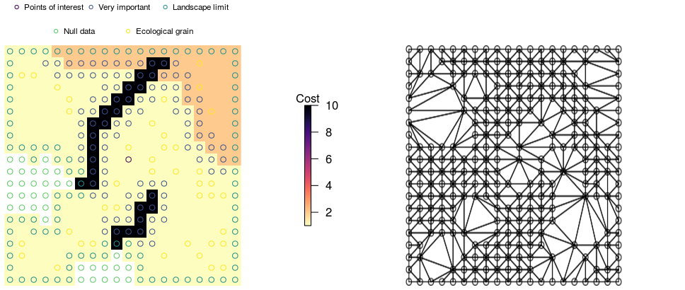
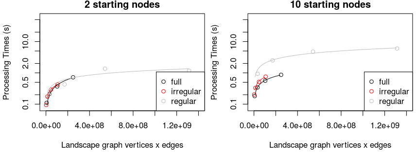
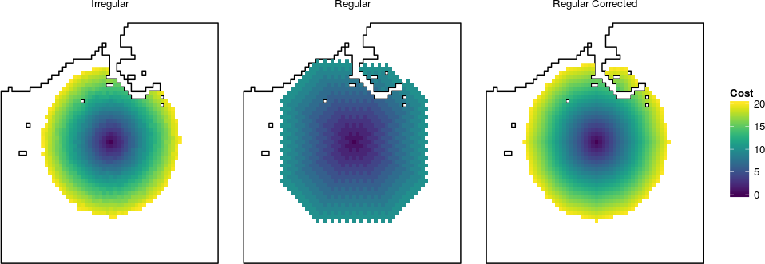

# Introduction

I propose a reference implementation of [@etherington2012least] that describes a method for generating accumulated cost surfaces using irregular landscape graphs. Accumulated cost surfaces are commonly used in landscape ecology, autonomous navigation, and civil engineering to represent travel costs and connectivity among points in a spatial domain. For the purposes of this paper, each accumulated cost surface will represent the connectivity between a single point _starting-node_ and the remaining points in the domain. The construction of these surfaces depends on an underlying landscape graph made up of nodes and distance-weighted edges. Conventionally, landscape graphs are constructed from a complete set of all possible nodes. The original article explored the use and constuction of irregular landscape graphs which are formed from an _intelligent_ subset of all possible points.

According to the original article, irregular landscape graphs allow for faster processing speeds relative to regular landscape graphs and avoid directional bias artifacts. The original implementation was made in Python whose sources are available upon request to the author of the original article. The proposed reference implementation has been coded in R because of the strength of existing libraries for generating accumulated cost surfaces using regular landscape graphs [@gdistance]. 

# Methods

The following reference implementation was based on the model description and source code of the original implementation (requested from the author). I attempted to follow the structure, style, and order-of-operations of the original with a few exceptions. For example, the same underlying Fortran algorithm is used to compute the Delaunay triangulations [@quickhull] forming the basis of irregular landscape graph construction. One notable difference in the reference implementation relative to the original is that regular landscape graphs are constructed using matrix operations rather than nested loops (see `gdistance` source code [@gdistance]). 

# Results

 {#fig:nodeselection}

First, I reproduced the basic output of Figures 3 and 4 using model inputs obtained from the author of the original article (Figures @fig:nodeselection , @fig:irlconstruction). I tested a range of different algorithms for producing Delaunay triangulations before settling on the same underlying algorithm as the original [@quickhull].

 {#fig:irlconstruction}

Next, I reproduced the performance comparisons in Figure 7 (Figure @fig:performance). The results suggest a more nuanced interpretation of the relative performance of the two methods. Although initial construction was much faster for regular landscape graphs, at a sufficiently high number of starting nodes the initial performance penalty afforded to irregular landscape graphs was outweighed by a decrease in per starting-node processing time. These findings can be attributed to the fact that the simple structures of regular landscape graphs are amenable to matrix operations and that irregular landscape graphs have a lower number of node/edge features.

 {#fig:performance}

Profiling of the reference implementation code revealed that the bulk of the processing time required to construct irregular landscape graphs was spent on Delaunay triangulation. Note that the proposed reference implementation uses compiled Fortran code [@quickhull] to implement Delaunay triangulations and compiled C code from the igraph package [@igraph] to construct graphs and calculate accumulated cost distances. 

Finally, I reproduced the directional bias tests in Figure 8 (Figure @fig:directionalbias). As in the original article, I found that regular graphs produced directionally-biased cost surfaces. However, I was able to correct for these biases by scaling graph edge weights according to the diagonal distance between grid cells (see the `gdistance::geoCorrection` function [@gdistance]).

 {#fig:directionalbias}

# Conclusion

I was able to replicate the finding of the original article that irregular landscape graphs provide a performance benefit relative to regular landscape graphs but this was true only under certain conditions. I found that although irregular landscape graphs suffer a high initialization cost relative to regular landscape graphs they have a lower individual (per-unit) starting-node processing time. Potential users of irregular landscape graphs should consider initialization and performance trade-offs prior to implementation.

# References
