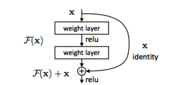
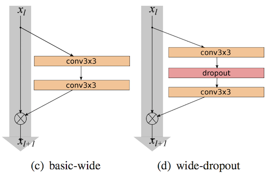
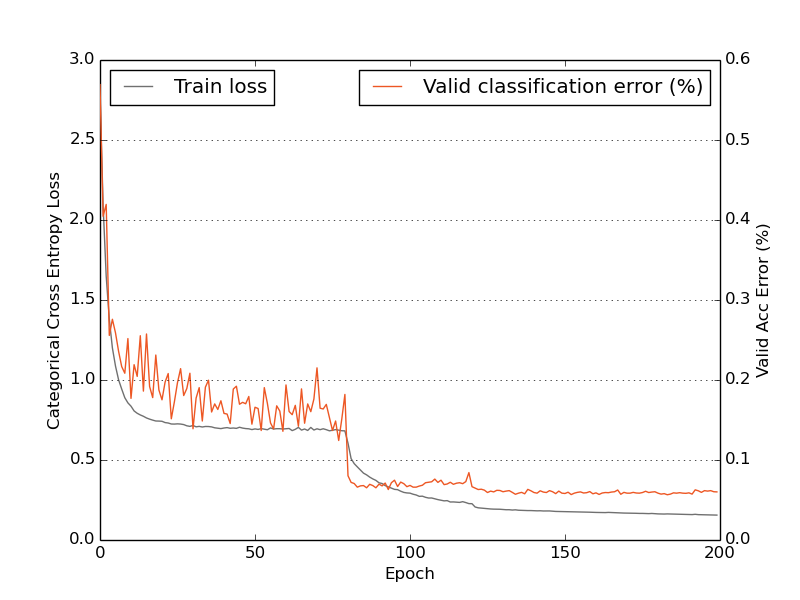
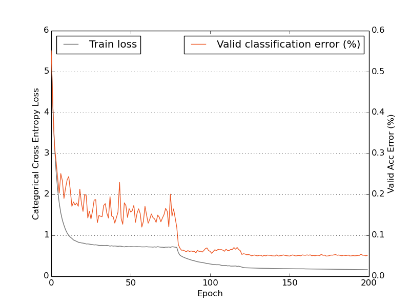
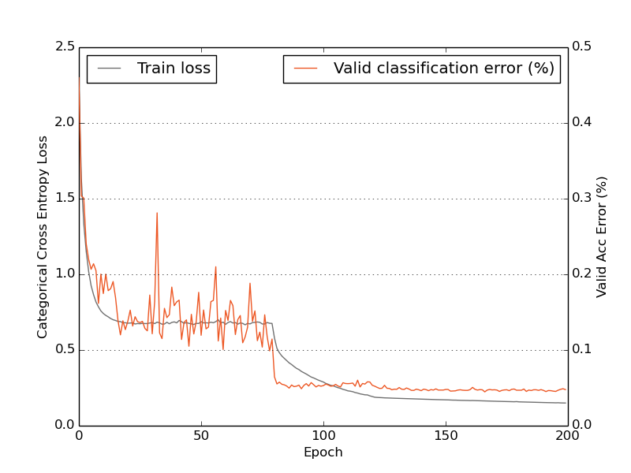

# Introduction

In 2015, Deep Residual Networks [1] were introduced as the winning solutions to ImageNet detection, ImageNet localization, COCO detection, and COCO segmentation, and they made it possible to train extremely deep neural networks of up to 1000 or more layers. The main idea is that Residual Networks "reformulate the layers as learning residual functions with reference to the layer inputs, instead of learning unreferenced functions" [1]. The basic idea is that the residual functions (blocks) are a combination of convolution layers and skip connections. The residual blocks are basically two branches that come together with an element-wise addition. One branch of the residual block is a stack of two convolution layers and the other is an identity function.

Diagram of the residual block [1]

Just like with normal convolution layers, these residual blocks can be layered to create networks of increasing depth. Below is the basic structure of the CIFAR-10 residual network [1][2], with the depth being controlled by a multiplier *n* which dictates how many residual blocks to insert between each downsampling layer. Downsampling is done by increasing the stride of the first convolution layer in a residual block. Whenever the number of filters are increased the first convolution layer within a residual block will do the downsampling.

| Group | Size | Multiplier |
| ------|:------:|:----------:|
| Conv1 | [3x3, 16] | - |
| Conv2 | [3x3, 16] [3x3, 16] | *n* |
| Conv3 | [3x3, 32] [3x3, 32] | *n* |
| Conv4 | [3x3, 64] [3x3, 64] | *n* |
| Avg-Pool | 8x8 | - |
| Softmax  | 10 | - |

Basic structure of the CIFAR-10 Residual Network. An initial convolution layer is followed by residual blocks of two 3x3 convolutions which are parallel to identity mappings, the output of the identity and convolution stacks are added after each block. The depth is mostly altered by the multiplier n which defines how many residual blocks to use in each section.

In addition to the stacked 3x3 convolution architecture, "Deep Residual Learning for Image Recognition" also introduces a bottleneck architecture which is designed to increase the depth without significantly increasing the amount of parameters.[1] The structure of this architecture can be seen below, the depth is still controlled by a multiplier *n*. The main changes are in the residual blocks.

| Group | Size | Multiplier |
| ------|:------:|:----------:|
| Conv1 | [3x3, 16] | - |
|  Conv2 | [1x1, 16] [3x3, 16] [1x1, 64] |  *n* |
|  Conv3 | [1x1, 32] [3x3, 32] [1x1, 128] |  *n* |
|  Conv4 | [1x1, 64] [3x3, 64] [1x1, 256] |  *n* |
| Avg-Pool | 8x8 | - |
| Softmax  | 10 | - |

This reproduction will focus on two recent improvements on the original residual network design, Preactivation Residual Networks and Wide Residual Networks.[2][3] The preactivation architecture switches up the order of the convolution, batch normalization and nonlinearities within each residual block. The wide architecture simply increases the number of convolution kernels within each preactivation residual block.

**Preactivation Residual Blocks:** "Identity Mappings in Deep Residual Networks" [2] introduces the preactivation architecture which changes the order of the convolution kernels, batch normalizations, and nonlinearities. The preactivation residual block is said to be easier to optimize and has implicit regularization.[2] The changes from the original residual block to the preactivation residual block are best viewed in the figure below.

The alterations from the original ResNet to the Preactivation ResNet

**Wide Residual Networks:** The preactivation residual networks are very deep but also very thin, so "Wide Residual Networks" [3] suggested that better improvements can be realized with a much more shallow and wide architecture. With normal residual networks we get diminishing returns in performance by increasing the depth. The wide residual networks are an attempt to mitigate this observation. The authors introduce "wider deep residual networks that significantly improve over [2], having 50 times less layers and being more than 2 times faster." [3] Their 16-layer wide residual Network performs as well as a thin 1001-layer preactivation residual network. The authors also claim that the wider networks are much more efficient on a GPU than the deeper thin networks.[3]

An example of the wide ResNet, it's basically a Preactivation ResNet with an increased filter count in the residual blocks and an optional dropout between the two convolution layers

The wide-ResNet simply adds another multiplier *k* that increases the number of filters used in each residual block. The idea of adding dropout in between the two convolution layers is also introduced with the wider residual blocks. The basic structure can be seen below.

| Group | Size | Multiplier |
| ------|:------:|:----------:|
| Conv1 | [3x3, 16] | - |
| Conv2 | [3x3, 16 x *k*] [3x3, 16 x *k*] | *n* |
| Conv3 | [3x3, 32 x *k*] [3x3, 32 x *k*] | *n* |
| Conv4 | [3x3, 64 x *k*] [3x3, 64 x *k*] | *n* |
| Avg-Pool | 8x8 | - |
| Softmax  | 10 | - |

# Methods

Both the original residual network and follow up preactivation residual network papers use identical preprocessing, training and regularization parameters. However, the wide residual paper uses different preprocessing, training, and regularization while still comparing results to the previous preactivation residual network. For wide residual networks they used "global contrast normalization and ZCA whitening"[3] to preprocess the CIFAR-10 images. However, the Microsoft Research Asia group only used "32×32 images, with
the per-pixel mean subtracted"[1] as their network inputs. It is possible that different network architectures would require different parameters and input data to achieve their best performance. But there should also be comparisons done where everything stays exactly the same except for the networks. This reproduction will be done using the preprocessing, training and regularization parameters from the original and preactivation residual network papers.[1][2]

**Preprocessing:** The only preprocessing done to the CIFAR-10 images are per-pixel mean subtraction as in [1] and [2].

**Data Augmentation:** As the data were fed into the network they were zero-padded with 4 pixels on every side and a random crop was taken of the original size of 32x32. This effectively results in random translations. Additionally, a horizontal flip was applied with probability 0.5. Unfortunately batch sizes of 128 could not be used and instead batch sizes of 64 had to be used due to hardware constraints.

**Training and regularization:** The networks were trained with 200 epochs (full passes through training dataset) with stochastic gradient descent, nesterov momentum of 0.9, and cross-entropy loss. For the bottleneck architecture, the initial learning rate was set to 0.01 to warm up the network and was increased to 0.1 at epoch 10 then continued on the same schedule as the other networks. For all other networks the learning rate was adjusted by the following schedule {0:0.1, 80: 0.01, 120: 0.001}. L2 regularization of 0.0001 was used used as in [1][2] and not 0.0005 like in [3].

**Dropout:** Dropout of 0.3 was used in the wide residual network.[3]

**Hardware and software:** This reproduction was done using the Theano and Lasagne software frameworks for mathematical computation and neural networks.[4][5] A Nvidia GTX 980 GPU was used to train and evaluate the networks. Although the impact should be insignificant it is worth noting that the original papers were both done with the Torch software package and a GPU with the same underlying architecture but more memory.[6]

# Results

The reproduction results are consistent with those of the original paper within a reasonable margin. The training parameters and preprocessing were kept the same to the extent possible. The most notable exceptions are the batchsize (due to hardware constraints) and the training parameters for the wide residual network.

| __ResNet Type__ | __Original Paper__ | __Test Results__ |
| :---------:|:---------:|:---------: |
| ResNet-110 | 6.37 | 6.06 |
| ResNet-164 | 5.46 | 5.64 |
| WResNet-n2-k4| 5.55 | 5.11 |

Additionally, the training plots seemed to have the same characteristics as those presented in the original papers. Training plots for residual networks are characterized by fairly noisy trends in the cross-entropy during training and also much less of a quadratic trend than seen in other neural networks. These trends are also seen here.

### ResNet-110

### ResNet-164

### Wide-ResNet n=2 k=4

Finally, the speed of the networks may be interesting to some users. Wide residual networks do seem to allow for more parameters with a minimal cost in training time.

| __ResNet Type__ | __Params__ | __Sec/Epoch__ |
| :---------:|:---------:|:---------: |
| ResNet-110 | 1.7M | 90 |
| ResNet-164 | 1.7M | 183 |
| WResNet-n2-k4| 2.7M | 113 |

# Conclusion

The results from the original two papers were reproduced within a small margin which is to be expected given the stochastic properties of neural networks. Additionally the results from the wide residual networks were able to be reproduced even with slightly different preprocessing and training parameters. This underscores the robust qualities and high performance of these new neural network architectures.

# References

* [1] He, Kaiming, et al. "Deep residual learning for image recognition." arXiv preprint arXiv:1512.03385 (2015). [link](https://arxiv.org/abs/1512.03385)
* [2] He, Kaiming, et al. "Identity mappings in deep residual networks." arXiv preprint arXiv:1603.05027 (2016). [link](https://arxiv.org/abs/1603.05027)
* [3] Sergey Zagoruyko, Nikos Komodakis, "Wide Residual Neural Networks." arXiv preprint arXiv:1605.07146 (2016). [link](https://arxiv.org/abs/1605.07146)
* [4] The Theano Development Team, et al. "Theano: A Python framework for fast computation of mathematical expressions." arXiv preprint arXiv:1605.02688 (2016). [link](https://arxiv.org/abs/1605.02688)
* [5] Dieleman, Sander, et al. "Lasagne: First Release." Zenodo: Geneva, Switzerland (2015). [link](http://lasagne.readthedocs.io/en/latest/index.html)
* [6] Collobert, Ronan, Koray Kavukcuoglu, and Clément Farabet. "Torch7: A matlab-like environment for machine learning." BigLearn, NIPS Workshop. No. EPFL-CONF-192376. (2011). [link](http://cs.nyu.edu/~koray/files/2011_torch7_nipsw.pdf)
