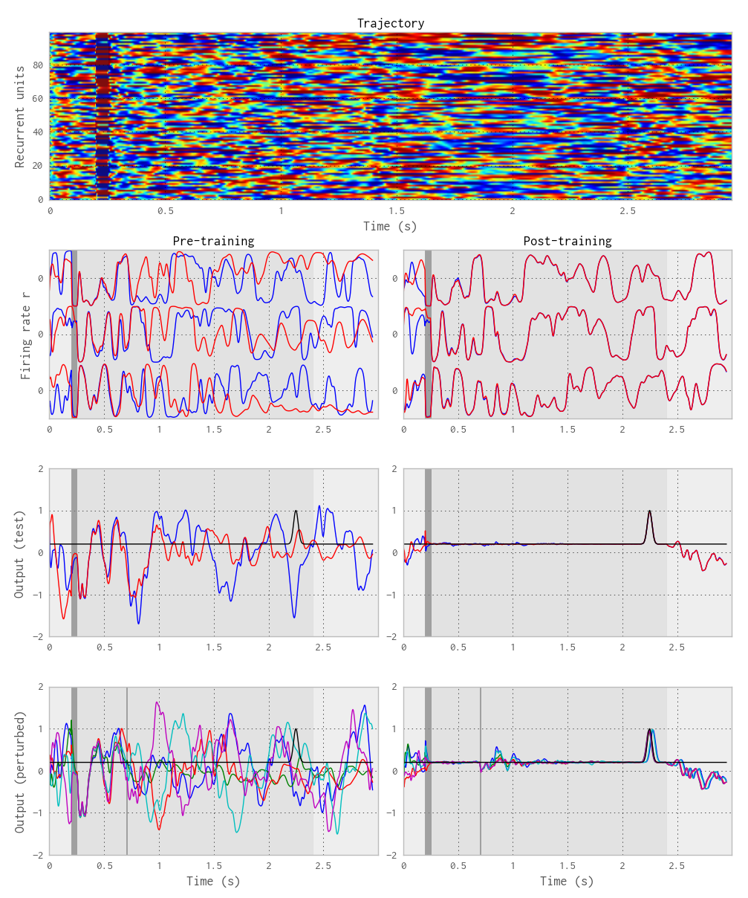
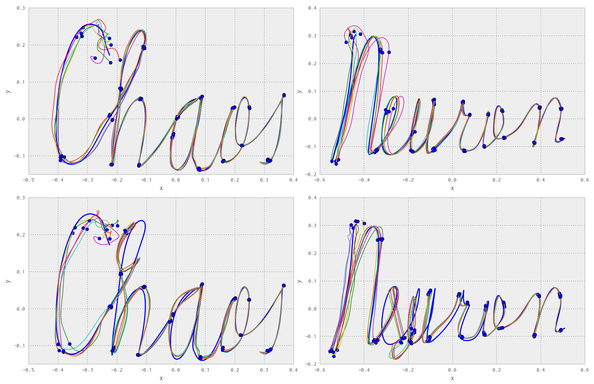

# Introduction

# Methods

## Structure of the network

```{.python}
self.W_in = np.random.randn(self.N, self.Ni)
```

## Learning rule

## Training procedure

# Results



<!--{#fig:fig1-->



<!--{#fig:fig2}-->


<!--{#fig:fig3}-->


# Conclusion

The reproduction of the model proposed by @Laje2013 was successful. Although the original article is already quite detailed and self-explanatory, the fact that the authors released the original MATLAB code on Pubmed Central allowed to resolve some small ambiguities and speed up the reproduction process.

1. 


# References
