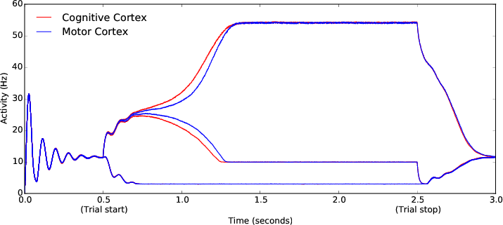
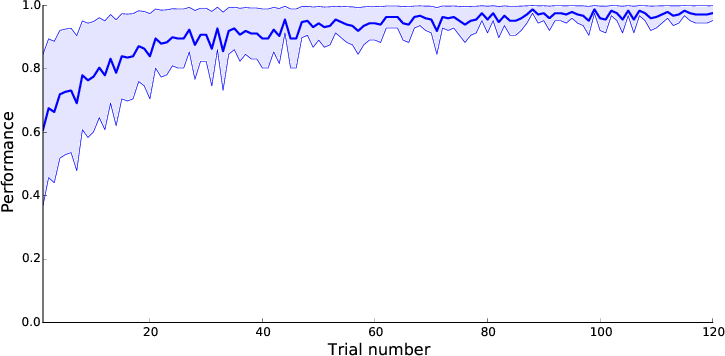

## Introduction

This is a reference implementation of the following model:

  M. Guthrie, A Leblois, A. Garenne, T. Boraud, "Interaction between cognitive
  and motor cortico-basal ganglia loops during decision making: a computational
  study", Journal of Neurophysiology, 109:3025-3040, 2013.


## Installation

It requires python, numpy, cython and matplotlib:

```bash
$ pip install numpy
$ pip install cython
$ pip install matplotlib
```

To compile the model, just type:

```bash
$ python setup.py build_ext --inplace
```

Then you can run a single trial:

```bash
$ python single-trial.py
```




Or the full version:

```bash
$ python 250-simulations.py
```


