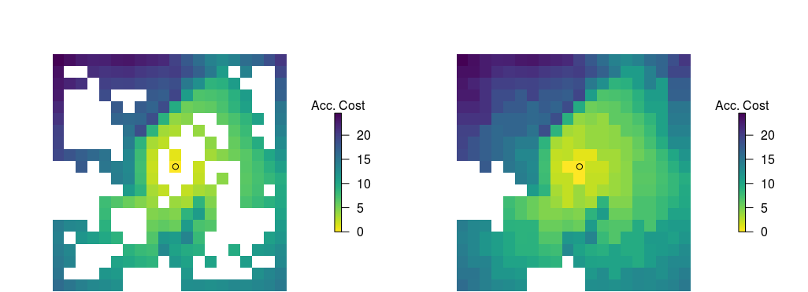
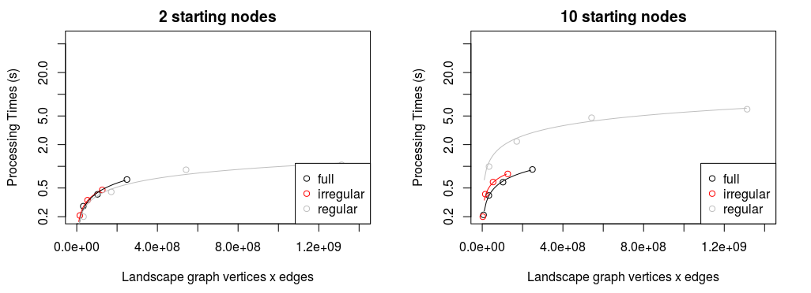
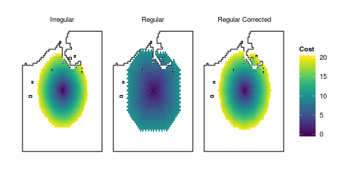

irlgraph
======

The `R` package `irlgraph` provides the functionality to generate accumulated cost surfaces using irregular landscape graphs.

##Installation
  ```R
  install.packages('devtools')  # package devtools needed
  devtools::install_github('jsta/irlgraph')
  ```
  
##Summary



**Figure 1: Construction of accumulated cost surfaces using irregular landscape graphs. Panels from left to right represent the process of: identifying graph nodes, Delaunay triangulation, generating partial accumulated cost surfaces, and interpolating to produce full accumulated cost surfaces.**



**Figure 2: Comparison of `system.time` processing speed when using regular and irregular graphs to produce accumulated cost surfaces. The performance benefit of irregular graphs becomes apparent with greater numbers of starting nodes.**



**Figure 3: Directional bias tests of irregular and regular graph approaches to generating accumulate cost surfaces. The `gdistance::geoCorrection` function eliminates directional bias associated with regular graphs.**

##Examples
**see vignette**

##References
**Thomas Etherington (2012)**. Least-cost modelling on irregular landscape graphs.
*Landscape Ecology*
[journal](http://dx.doi.org/10.1007/s10980-012-9747-y)
